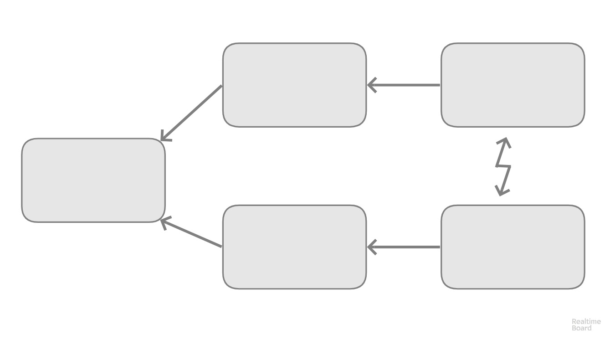
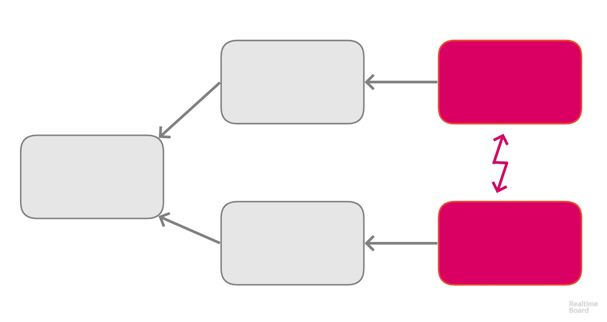
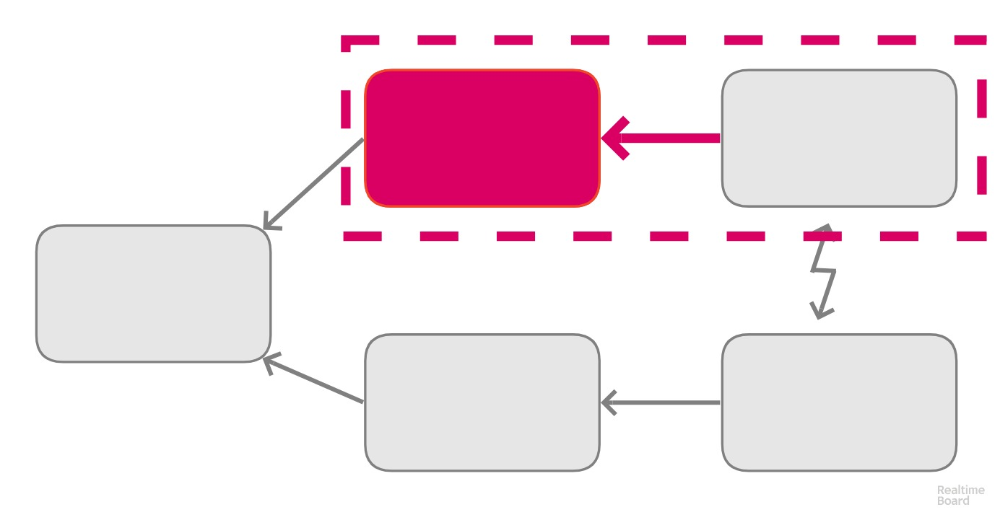
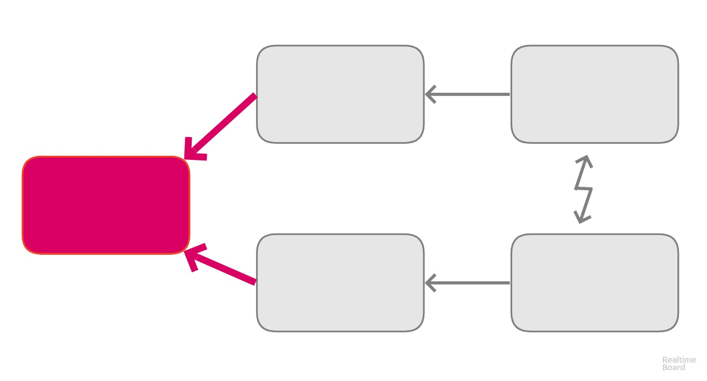
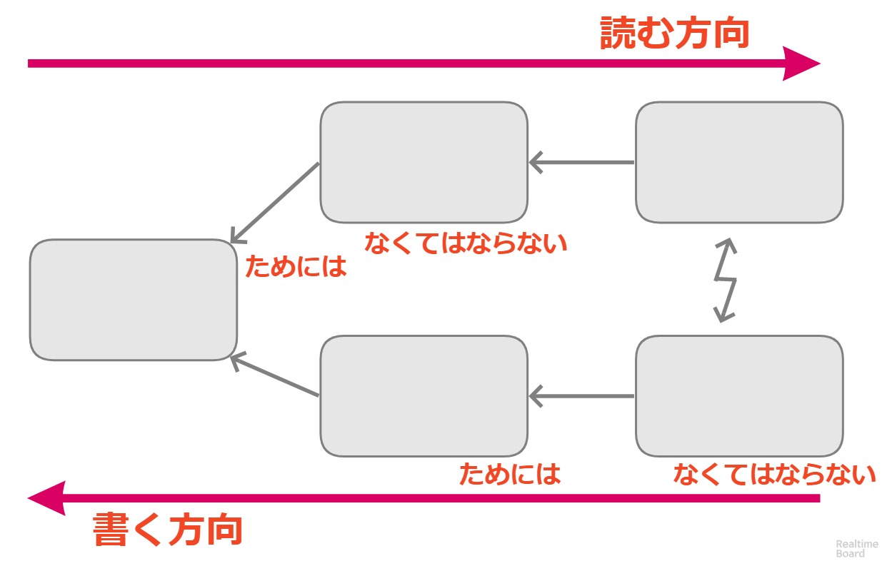
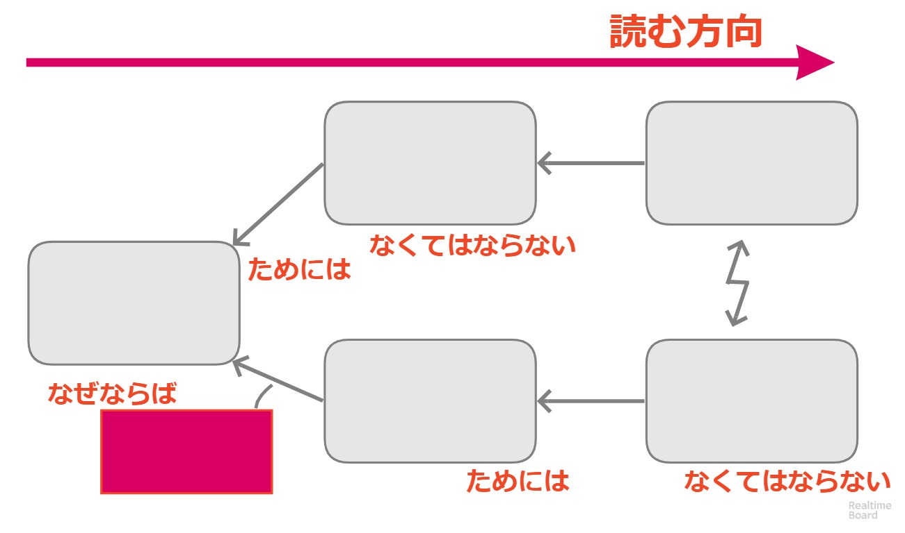
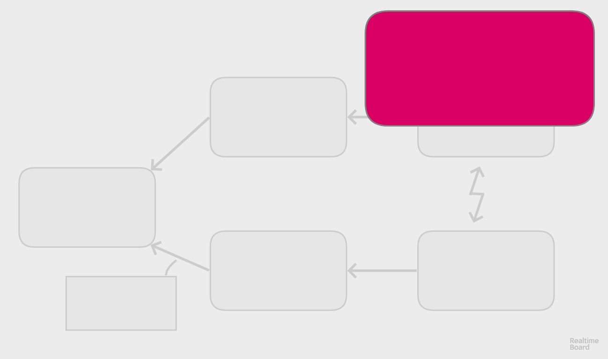

<!-- .slide: data-background-image="img/front_page.jpg" -->

# クラウド

TOCfE BootCamp KANSAI 2018/06/23

- 講師デモ <!-- .element: style="font-weight: 900;" -->
- 全体演習 <!-- .element: style="font-size: 70%;" -->
- ガイド付きグループ演習 <!-- .element: style="font-size: 70%;" -->
- グループ演習 <!-- .element: style="font-size: 70%;" -->
- 個人演習 <!-- .element: style="font-size: 70%;" -->

--

 <!-- .element height="10%" width="10%" align="left" -->

  1. WEB系アプリのエンジニア
  2. TOCfEに触れたのは 2017年04月 が初めて
  3. 国際認定プログラムを経て講師は2回目

---

## クラウドってどんなもの？

対立する行動を通じて問題を特定し  
対立を解消する <!-- .element: class="fragment fade-up" -->

--

### 対立

ジレンマ, 議論, 意思決定など  
どちらが良いか悩み、諦めたり、フラストレーションを起こす原因のこと

--

#### 対立を見つけ出すのも解消するのも難しい

🙈 🙉 🙊  <!-- .element: class="fragment" style="font-size: 200%;" -->  

--

解決を諦めないために

## クラウドを使っていきましょう

---

### クラウドを使う

クラウドは5つのボックスと  
ボックスのつながりを示す矢印で構成される

 <!-- .element height="80%" width="80%" style="border: none;" -->

--

### 対立している状況

衝突する2者間(立場や手段)を  
2つのボックスにそれぞれを書き出す

 <!-- .element height="80%" width="80%" style="border: none;" -->

--

### なぜ？

なぜ対立する状況になるのか、  
要望を対立するボックスにつなげる

 <!-- .element height="80%" width="80%" style="border: none;" -->

--

### どうなれば良いか

2つの要望を同時に満たせる目標は何だろうか？

 <!-- .element height="80%" width="80%" style="border: none;" -->

--

### クラウドを確認する

間違いなく意味が通っていることを確認するには、
声に出して読み上げることで確認できる

 <!-- .element height="70%" width="70%" style="border: none;" -->

--

### つながりを説明する

なぜボックスがつながるのか情報不足があれば、
仮定のボックスをつなげて説明する

 <!-- .element height="80%" width="80%" style="border: none;" -->

--

### 解決策を出す

妥協や一方を貶めるのではなく  
両者を満たす解決策とは何かを考える

 <!-- .element height="80%" width="80%" style="border: none;" -->

---

## 特定するための質問

読み上げることの他に、  
ボックスそれぞれに異なる表現で質問することで根底の原因が見つけやすくなる

--

<!-- .slide: style="font-size: 90%;" -->

- 対立
  + それぞれの立場は何をしたいのですか？  <!-- .element: class="fragment" -->
  + ある立場で取りたい行動と別の立場と対立するものはなんですか？  <!-- .element: class="fragment" -->
- 要望
  + それぞれの立場はどういう行動を選択しましたか？  <!-- .element: class="fragment" -->
  + なぜこの行動や手段が重要なのですか？  <!-- .element: class="fragment" -->
  + この行動を取らないとどのような要望が脅かされますか？  <!-- .element: class="fragment" -->
- 目標
  + 2者が達成したいと思うような、似通った目標はありますか？  <!-- .element: class="fragment" -->
  + 2者が望むような理想的な状況になりますか？  <!-- .element: class="fragment" -->

---

違和感がなくなるまで
書いて読み直しましょう

---

<!-- .slide: style="text-align: left;" -->

### 事例

技術勉強会の開催日が迫ったある日、  
協賛企業の担当者から「参加者に対して弊社への転職案内を出す」と言われた。  
しかし勉強会の運営方針として勧誘や営業は禁止していた。  
もう開催まで猶予がない。許可するか否か決めなければいけない。

--

<!-- .slide: data-background-image="img/01_cloud.jpg" data-background-size="contain" -->

--

<!-- .slide: data-background-image="img/02_cloud.jpg" data-background-size="contain" -->

--

<!-- .slide: data-background-image="img/03_0_cloud.jpg" data-background-size="contain" -->

--

<!-- .slide: data-background-image="img/03_1_cloud.jpg" data-background-size="contain" -->

--

<!-- .slide: data-background-image="img/03_2_cloud.jpg" data-background-size="contain" -->

--

<!-- .slide: data-background-image="img/03_3_cloud.jpg" data-background-size="contain" -->

--

<!-- .slide: data-background-image="img/03_4_cloud.jpg" data-background-size="contain" -->

--

<!-- .slide: data-background-image="img/03_5_cloud.jpg" data-background-size="contain" -->

--

<!-- .slide: data-background-image="img/04_cloud.jpg" data-background-size="contain" -->

--

<!-- .slide: data-background-image="img/05_cloud.jpg" data-background-size="contain" -->

---

👼  <!-- .element: style="font-size: 800%;" -->